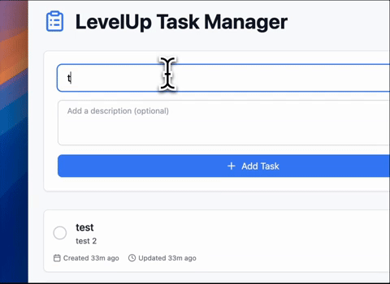

# LevelUp Task Manager


<div align="center">
  
  <br />
  <em>LevelUp Task Manager demonstration</em>
</div>

<br />

A modern, full-stack task management application built with React, TypeScript, and Spring Boot. This project demonstrates professional-grade web development practices, including type safety, optimistic UI updates, and responsive design.

## 🚀 Features

- 📝 Create, update, and delete tasks
- ✅ Mark tasks as complete/incomplete
- 📊 Real-time performance metrics
- 🔄 Optimistic UI updates for smooth user experience
- 📱 Responsive design for all devices
- ⚡ Error handling and loading states
- 🎨 Modern, clean UI with Tailwind CSS

## 🛠️ Technical Stack

### Frontend
- **React** - Modern UI framework
- **TypeScript** - Type-safe development
- **Tailwind CSS** - Utility-first CSS framework
- **React Hooks** - State management
- **Optimistic Updates** - Enhanced user experience

### Backend
- RESTful API integration
- Error handling and data persistence
- Async/await patterns

## 🏗️ Project Structure

```
project/
├── src/
│   ├── components/     # Reusable UI components
│   ├── services/      # API service layer
│   ├── types/         # TypeScript type definitions
│   └── App.tsx        # Main application component
```

## 🚀 Getting Started

1. Clone the repository
```bash
git clone https://github.com/yourusername/levelup.git
```

2. Start the backend server
```bash
cd backend
mvn spring-boot:run
```

3. Start the frontend development server
```bash
cd project
npm install
npm run dev
```

4. Open your browser and navigate to `http://localhost:5173`

## 💡 Key Technical Highlights

- **Type Safety**: Full TypeScript implementation ensuring code reliability
- **Optimistic UI**: Immediate feedback with rollback capabilities
- **Error Handling**: Comprehensive error states and user feedback
- **Performance**: Efficient state management and rendering
- **Responsive Design**: Mobile-first approach with Tailwind CSS

## 🔮 Future Improvements

- [ ] User authentication
- [ ] Task categories and tags
- [ ] Due dates and reminders
- [ ] Data persistence with local storage
- [ ] Dark mode support

## 📝 License

This project is licensed under the MIT License - see the [LICENSE](LICENSE) file for details.

## 🤝 Contributing

Contributions are welcome! Please feel free to submit a Pull Request.